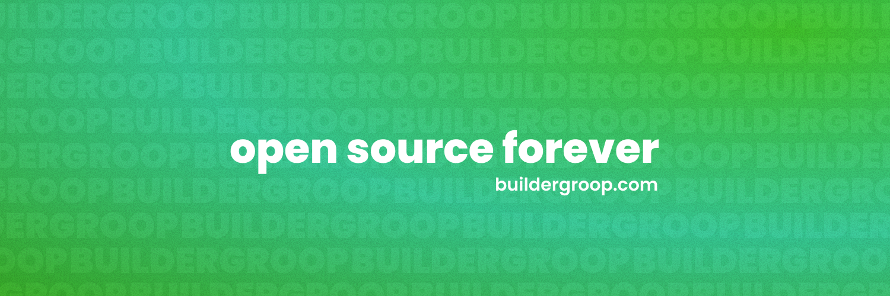

<h1 align="center">Hi, I'm Natya Vidhan Biswas AKA Studious Gamer</h1>
<h3 align="center">A 15-year-old Software, Web and Game Developer from India</h3>

  

<h3 align="left">Technologies I Use:</h3>

<h3 align="left">Connect with me:</h3>

<h3 align="left">Support me:</h3>

### GitHub Stats:

   

